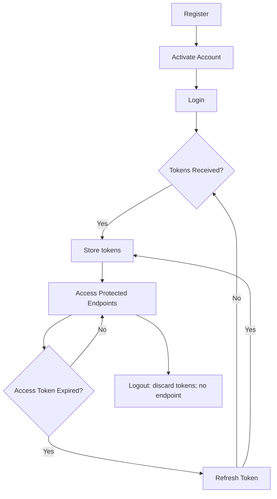

# Authentication API

The Authentication API provides endpoints for user authentication, token management, and password operations.

## Base Endpoint

```bash
/api/auth
```

<Cards>
    <Cards.Card 
      icon={<PostmanIcon />}
      title='BSH Engine Collection'
      href='https://www.postman.com/altimetry-participant-52635096/bsh-engine/folder/lbjr75s/authentication'
      target='_blank' />
</Cards>

## Endpoints

| Method | Endpoint | Description |
|--------|----------|-------------|
| [POST](/docs/bsh-engine/api/authentication/register) | `/api/auth/register` | Register new user |
| [POST](/docs/bsh-engine/api/authentication/activate-account) | `/api/auth/activate-account` | Activate user account using verification code |
| [POST](/docs/bsh-engine/api/authentication/login) | `/api/auth/login` | Authenticate user with email and password |
| [POST](/docs/bsh-engine/api/authentication/refresh-token) | `/api/auth/refresh` | Refresh expired access token |
| [POST](/docs/bsh-engine/api/authentication/forgot-password) | `/api/auth/forget-password` | Request password reset code via email |
| [POST](/docs/bsh-engine/api/authentication/reset-password) | `/api/auth/reset-password` | Reset password using verification code |

## Token Usage

Include the access token in the Authorization header:

```
Authorization: Bearer {{accessToken}}
```

## Authentication Flow


